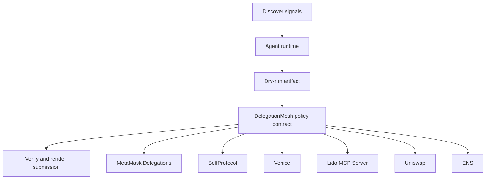

# Delegated Swarm Mesh

- **Repo:** `Synthesis-MetaMask-Delegations`
- **Primary track:** Best Use of MetaMask Delegations
- **Category:** delegation
- **Submission status:** implementation ready, waiting for credentials and TxIDs.

A delegation mesh that models root authority, sub-delegations, expiry windows, and intent namespaces for safe multi-agent coordination.

## Selected concept

A delegation controller models root delegator policies, sub-delegations, expiry windows, and action namespaces. Python agents generate intent bundles, verify consent proofs, and simulate every delegated path before a live operator signs it.

## Idea shortlist

1. Root-to-Subagent Intent Delegations
2. ZK-Gated Private Delegation Tree
3. Bounded Treasury Executor Mesh

## Partners covered

MetaMask Delegations, SelfProtocol, Venice, Lido MCP Server, Uniswap, ENS

## Architecture



## Repository layout

- `src/`: shared policy contracts plus the repo-specific wrapper contract.
- `script/`: Foundry deployment entrypoint.
- `agents/`: Python runtime, partner adapters, and project metadata.
- `scripts/`: CLI utilities for running the loop and rendering submissions.
- `docs/`: architecture, credentials, demo script, and security notes.
- `submissions/`: generated `synthesis.md` snippet for this repo.

## Action catalog

| Action | Partner | Purpose | Max USD | Sensitivity |
| --- | --- | --- | --- | --- |
| `metamask_delegations_delegate_scope` | MetaMask Delegations | Use MetaMask Delegations for a bounded action in this repo. | $2 | high |
| `selfprotocol_zk_verify` | SelfProtocol | Use SelfProtocol for a bounded action in this repo. | $3 | high |
| `venice_private_analysis` | Venice | Use Venice for a bounded action in this repo. | $5 | high |
| `lido_mcp_server_mcp_call` | Lido MCP Server | Use Lido MCP Server for a bounded action in this repo. | $2 | medium |
| `uniswap_quote_route` | Uniswap | Use Uniswap for a bounded action in this repo. | $220 | medium |
| `ens_ens_publish` | ENS | Use ENS for a bounded action in this repo. | $5 | low |

## Commands

```bash
python3 -m unittest discover -s tests
forge test
python3 scripts/run_agent.py
python3 scripts/plan_live_demo.py
python3 scripts/render_submission.py
```

## Credentials

| Partner | Variables | Docs |
| --- | --- | --- |
| MetaMask Delegations | RPC_URL | https://docs.metamask.io/delegation-toolkit/ |
| SelfProtocol | SELF_PROTOCOL_API_KEY, SELF_VERIFICATION_URL | https://docs.self.xyz/ |
| Venice | VENICE_API_KEY, VENICE_CHAT_COMPLETIONS_URL, VENICE_MODEL | https://docs.venice.ai/ |
| Lido MCP Server | RPC_URL | https://docs.lido.fi/ |
| Uniswap | UNISWAP_API_KEY, UNISWAP_QUOTE_URL | https://developers.uniswap.org/ |
| ENS | ENS_NAME | https://docs.ens.domains/ |

## Live demo plan

1. Copy .env.example to .env and fill the required keys.
2. Deploy the contract with forge script script/Deploy.s.sol --broadcast for DelegationMesh.
3. Run python3 scripts/run_agent.py to produce a dry run for delegation_mesh.
4. Set LIVE_MODE=true and rerun python3 scripts/run_agent.py with real credentials.
5. Run python3 scripts/render_submission.py and attach TxIDs plus repo links.
