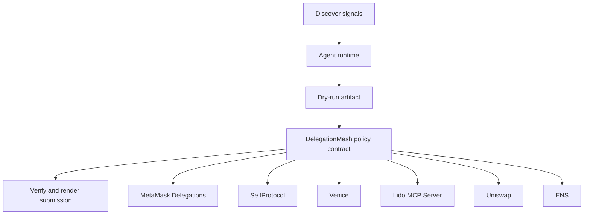

# Delegated Swarm Mesh

- **Repo:** [Synthesis-MetaMask-Delegations](https://github.com/CrystallineButterfly/Synthesis-MetaMask-Delegations)
- **Primary track:** Best Use of MetaMask Delegations
- **Category:** delegation
- **Primary contract:** `DelegationMesh`
- **Primary module:** `delegation_mesh`
- **Submission status:** implementation ready, waiting for credentials and TxIDs.

## What this repo does

A delegation mesh that models root authority, sub-delegations, expiry windows, and intent namespaces for safe multi-agent coordination.

## Why this build matters

A delegation controller models root delegator policies, sub-delegations, expiry windows, and action namespaces. Python agents generate intent bundles, verify consent proofs, and simulate every delegated path before a live operator signs it.

## Submission fit

- **Primary track:** Best Use of MetaMask Delegations
- **Overlap targets:** SelfProtocol, Venice Private Agents, Lido MCP Server, Uniswap Agentic Finance, ENS, YieldGuard
- **Partners covered:** MetaMask Delegations, SelfProtocol, Venice, Lido MCP Server, Uniswap, ENS

## Idea shortlist

1. Root-to-Subagent Intent Delegations
2. ZK-Gated Private Delegation Tree
3. Bounded Treasury Executor Mesh

## System graph



## Repository contents

| Path | What it contains |
| --- | --- |
| `src/` | Shared policy contracts plus the repo-specific wrapper contract. |
| `script/Deploy.s.sol` | Foundry deployment entrypoint for the policy contract. |
| `agents/` | Python runtime, project spec, env handling, and partner adapters. |
| `scripts/` | Terminal entrypoints for run, demo planning, and submission rendering. |
| `docs/` | Architecture, credentials, security notes, and demo steps. |
| `submissions/` | Generated `synthesis.md` snippet for this repo. |
| `test/` | Foundry tests for the Solidity control layer. |
| `tests/` | Python tests for runtime and project context. |
| `agent.json` | Submission-facing agent manifest. |
| `agent_log.json` | Local execution log and status trail. |

## Autonomy loop

1. Discover signals relevant to the repo track and its overlap targets.
2. Build a bounded plan with per-action and compute caps.
3. Persist a dry-run artifact before any live execution.
4. Enforce onchain policy through the guarded contract wrapper.
5. Verify outputs, update receipts, and render submission material.

## Security controls

- Admin-managed allowlists for targets and selectors.
- Per-action caps, daily caps, cooldown windows, and a principal floor.
- Reporter-only receipt anchoring and proof attachment.
- Env-only secrets; no committed private keys or partner tokens.
- Pause switch plus dry-run-first execution flow.

## Action catalog

| Action | Partner | Purpose | Max USD | Sensitivity |
| --- | --- | --- | --- | --- |
| `metamask_delegations_delegate_scope` | MetaMask Delegations | Use MetaMask Delegations for a bounded action in this repo. | $2 | high |
| `selfprotocol_zk_verify` | SelfProtocol | Use SelfProtocol for a bounded action in this repo. | $3 | high |
| `venice_private_analysis` | Venice | Use Venice for a bounded action in this repo. | $5 | high |
| `lido_mcp_server_mcp_call` | Lido MCP Server | Use Lido MCP Server for a bounded action in this repo. | $2 | medium |
| `uniswap_quote_route` | Uniswap | Use Uniswap for a bounded action in this repo. | $220 | medium |
| `ens_ens_publish` | ENS | Use ENS for a bounded action in this repo. | $5 | low |

## Local terminal flow (Anvil + Sepolia)

```bash
export SEPOLIA_RPC_URL=https://sepolia.infura.io/v3/YOUR_KEY
anvil --fork-url "$SEPOLIA_RPC_URL" --chain-id 11155111
cp .env.example .env
# keep private keys only in .env; TODO.md stays local-only too
forge script script/Deploy.s.sol --rpc-url "$RPC_URL" --broadcast
python3 scripts/run_agent.py
python3 scripts/render_submission.py
```

## Commands

```bash
python3 -m unittest discover -s tests
forge test
python3 scripts/run_agent.py
python3 scripts/plan_live_demo.py
python3 scripts/render_submission.py
```

## Credentials

| Partner | Variables | Docs |
| --- | --- | --- |
| MetaMask Delegations | RPC_URL | https://docs.metamask.io/delegation-toolkit/ |
| SelfProtocol | SELF_PROTOCOL_API_KEY, SELF_VERIFICATION_URL | https://docs.self.xyz/ |
| Venice | VENICE_API_KEY, VENICE_CHAT_COMPLETIONS_URL, VENICE_MODEL | https://docs.venice.ai/ |
| Lido MCP Server | RPC_URL | https://docs.lido.fi/ |
| Uniswap | UNISWAP_API_KEY, UNISWAP_QUOTE_URL | https://developers.uniswap.org/ |
| ENS | ENS_NAME | https://docs.ens.domains/ |

## Live demo plan

1. Copy .env.example to .env and fill the required keys.
2. Deploy the contract with forge script script/Deploy.s.sol --broadcast for DelegationMesh.
3. Run python3 scripts/run_agent.py to produce a dry run for delegation_mesh.
4. Set LIVE_MODE=true and rerun python3 scripts/run_agent.py with real credentials.
5. Run python3 scripts/render_submission.py and attach TxIDs plus repo links.
